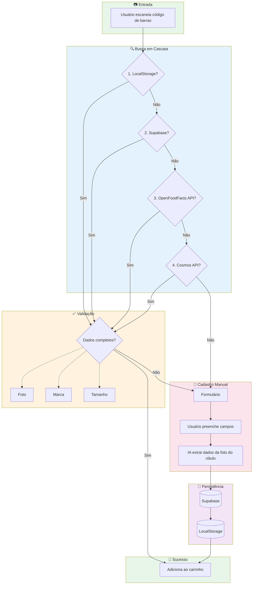

# Escopo Técnico - Sem Susto 🛒

Este documento contém referências técnicas e fluxogramas que servem de guia para o desenvolvimento.

---

## Fluxo de Escaneamento de Produto

O diagrama abaixo representa o fluxo completo quando o usuário escaneia um código de barras:

### Ordem de Prioridade da Cascata

| Posição | Fonte           | Latência Esperada | Observação                          |
|---------|-----------------|-------------------|-------------------------------------|
| 1       | LocalStorage    | <10ms             | Cache local do usuário              |
| 2       | Supabase        | <200ms            | Nosso banco de dados compartilhado  |
| 3       | OpenFoodFacts   | ~500ms            | API pública gratuita                |
| 4       | Cosmos          | ~800ms            | API comercial (fallback final)      |

### Tratamento de Dados Parciais

Se qualquer fonte retornar dados incompletos (sem foto, marca ou tamanho), o sistema deve:

1. **Exibir os dados encontrados** no formulário (pré-preenchido)
2. **Solicitar ao usuário** que complete as informações faltantes
3. **Salvar o produto completo** no Supabase + LocalStorage

---

## Referências

- [roadmap.md](./roadmap.md) - Planejamento de fases
- [README.md](../README.md) - Visão geral do projeto
