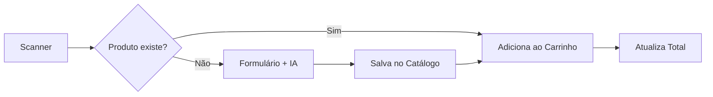

<div align="center">

# 🛒 Sem Susto

**Controle seus gastos durante as compras em tempo real**

[](https://react.dev/)
[](https://www.typescriptlang.org/)
[](https://vitejs.dev/)
[](https://ai.google.dev/)

[Demonstração](#-demonstração) •
[Funcionalidades](#-funcionalidades) •
[Tecnologias](#-tecnologias) •
[Instalação](#-instalação) •
[Arquitetura](#-arquitetura)

</div>

---

## 📚 Sobre o Projeto

**Sem Susto** é um aplicativo web mobile-first que resolve um problema comum: não saber quanto você está gastando durante as compras. Com ele, você escaneia os produtos enquanto compra e acompanha o total acumulado em tempo real.

### 🎯 Problema Resolvido

Consumidores frequentemente perdem o controle do valor total durante compras, resultando em orçamentos estourados. Este app oferece uma solução prática e inteligente para manter o controle financeiro.

> [!NOTE] > **Histórico:** Este projeto foi originalmente chamado **"Preço Certo"** e renomeado para **"Sem Susto"** em Janeiro/2026 para refletir o novo domínio `semsusto.app.br`. O repositório GitHub pode ainda conter referências ao nome antigo em commits históricos.

---

## ✨ Funcionalidades

| Feature                            | Descrição                                                      |
| ---------------------------------- | -------------------------------------------------------------- |
| 📷 **Scanner de Código de Barras** | Leitura via câmera com fallback para entrada manual            |
| 🤖 **IA para Leitura de Rótulos**  | Extração automática de nome, marca e tamanho via Google Gemini |
| 🛒 **Carrinho Inteligente**        | Controle de quantidade com atualização do total em tempo real  |
| 💾 **Catálogo Persistente**        | Produtos cadastrados ficam salvos para futuras compras         |
| 📱 **Design Responsivo**           | Interface otimizada para uso durante as compras                |
| 🎓 **Tutorial de Primeiro Acesso** | Guia visual ensinando a usar scanner e foto para OCR           |
| ✅ **Validação Inteligente**       | Foco automático no campo inválido ao tentar salvar             |
| 🎨 **Design Premium**              | Botão Rainbow animado, Title Case automático e fluxo ágil      |

---

## 🛠 Tecnologias

### Core

- **React 19** — Biblioteca UI com hooks e functional components
- **TypeScript 5.8** — Tipagem estática para maior robustez
- **Vite 7** — Build tool ultrarrápido com HMR

### Inteligência Artificial

- **Google Gemini / OpenRouter** — Visão computacional via Strategy Pattern
- **Structured Output** — Respostas em JSON com schema validado
- **html5-qrcode** — Scanner de código de barras via câmera

### Infraestrutura

- **Supabase** — PostgreSQL gerenciado + Autenticação + API REST
- **Docker Compose** — Ambiente de desenvolvimento isolado e reproduzível
- **PostgreSQL** — Banco de dados local para desenvolvimento

---

## 🚀 Instalação

### Pré-requisitos

- [Docker](https://www.docker.com/) instalado
- Chave de API do [OpenRouter](https://openrouter.ai/) (Recomendado) ou [Google AI Studio](https://aistudio.google.com/)

### Setup com Docker Compose (Recomendado)

```bash
# 1. Clone o repositório
git clone https://github.com/LKSFerreira/sem-susto.git
cd sem-susto

# 2. Configure as variáveis de ambiente
cp .env.example .env.local
# Edite .env.local e adicione sua chave em VITE_OPENROUTER_TOKEN

# 3. Suba os containers (Recomendado)
# O script detecta seu IP automaticamente para acesso via celular
./dev.sh

# 4. Acesse a aplicação
# O terminal mostrará os links de acesso (Local e Celular)
```

O app estará disponível em `https://localhost:5173`

### Setup Local (Alternativo)

```bash
# Requer Node.js 20+
npm install
npm run dev
```

---

## 🏗 Arquitetura

```
sem-susto/
├── .docker/                # Arquivos Docker Compose
├── .metadocs/              # Documentação de projeto
│   └── roadmap.md          # Planejamento de features
├── contextos/              # Contextos React (injeção de dependências)
├── repositorios/           # Camada de persistência (Repository Pattern)
├── components/             # Componentes React reutilizáveis
│   ├── ScannerBarras.tsx   # Interface do scanner
│   ├── FormularioProduto.tsx # Cadastro com IA
│   └── ModalDoacao.tsx     # Sistema de apoio
├── services/               # Lógica de negócio
│   ├── ia.ts               # Integração com Gemini
│   └── utilitarios.ts      # Funções auxiliares
├── App.tsx                 # Componente principal
├── types.ts                # Definições TypeScript
└── constants.ts            # Configurações globais
```

### Fluxo de Dados



---

## 📸 Screenshots

> _Em desenvolvimento — adicionar capturas de tela do app_

---

## 🗺 Roadmap

- [x] MVP com scanner e carrinho
- [x] Integração com Gemini AI / Groq
- [x] Scanner real com `html5-qrcode`
- [x] Deploy em produção (https://www.semsusto.app)
- [ ] Histórico de compras
- [ ] Comparador de preços entre lojas
- [ ] PWA com suporte offline completo

Veja o [roadmap completo](./.metadocs/roadmap.md) para mais detalhes.

---

## 🤝 Contribuindo

Contribuições são bem-vindas! Sinta-se à vontade para abrir issues ou pull requests.

---

## 📄 Licença

Este projeto está sob a licença MIT. Veja o arquivo [LICENSE](./LICENSE) para mais detalhes.

---

<div align="center">

**Desenvolvido com 💚 por [Lucas Ferreira](https://github.com/LKSFerreira)**

</div>
