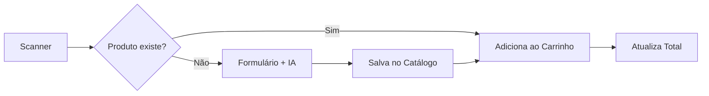

<div align="center">

# 🛒 Preço Certo

**Controle seus gastos no supermercado em tempo real**

[](https://react.dev/)
[](https://www.typescriptlang.org/)
[](https://vitejs.dev/)
[](https://ai.google.dev/)

[Demonstração](#-demonstração) •
[Funcionalidades](#-funcionalidades) •
[Tecnologias](#-tecnologias) •
[Instalação](#-instalação) •
[Arquitetura](#-arquitetura)

</div>

---

## 📚 Sobre o Projeto

**Preço Certo** é um aplicativo web mobile-first que resolve um problema comum: a surpresa no caixa do supermercado. Com ele, você escaneia os produtos durante a compra e acompanha o total acumulado em tempo real.

### 🎯 Problema Resolvido

Consumidores frequentemente perdem o controle do valor total durante compras, resultando em orçamentos estourados. Este app oferece uma solução prática e inteligente para manter o controle financeiro.

---

## ✨ Funcionalidades

| Feature                            | Descrição                                                      |
| ---------------------------------- | -------------------------------------------------------------- |
| 📷 **Scanner de Código de Barras** | Leitura via câmera com fallback para entrada manual            |
| 🤖 **IA para Leitura de Rótulos**  | Extração automática de nome, marca e tamanho via Google Gemini |
| 🛒 **Carrinho Inteligente**        | Controle de quantidade com atualização do total em tempo real  |
| 💾 **Catálogo Persistente**        | Produtos cadastrados ficam salvos para futuras compras         |
| 📱 **Design Responsivo**           | Interface otimizada para uso durante as compras                |
| 🌙 **Modo Offline**                | Funciona sem conexão após primeiro carregamento                |

---

## 🛠 Tecnologias

### Core

- **React 19** — Biblioteca UI com hooks e functional components
- **TypeScript 5.8** — Tipagem estática para maior robustez
- **Vite 7** — Build tool ultrarrápido com HMR

### Inteligência Artificial

- **Google Gemini API** — Visão computacional para leitura de rótulos
- **Structured Output** — Respostas em JSON com schema validado

### Infraestrutura

- **Supabase** — PostgreSQL gerenciado + Autenticação + API REST
- **Docker Compose** — Ambiente de desenvolvimento isolado e reproduzível
- **Docker Compose** — PostgreSQL local para desenvolvimento

---

## 🚀 Instalação

### Pré-requisitos

- [Docker](https://www.docker.com/) instalado
- [VS Code](https://code.visualstudio.com/) com extensão [Dev Containers](https://marketplace.visualstudio.com/items?itemName=ms-vscode-remote.remote-containers)
- Chave de API do [Google AI Studio](https://aistudio.google.com/)

### Setup com Dev Container (Recomendado)

```bash
# 1. Clone o repositório
git clone https://github.com/LKSFerreira/preco-certo.git
cd preco-certo

# 2. Abra no VS Code
code .

# 3. Quando solicitado, clique em "Reopen in Container"
#    Ou use: Ctrl+Shift+P → "Dev Containers: Reopen in Container"

# 4. Configure a variável de ambiente
cp .env.example .env.local
# Edite .env.local e adicione suas chaves (Gemini e Supabase)

# 5. Execute o projeto
npm run dev
```

O app estará disponível em `http://localhost:5173`

### Setup Local (Alternativo)

```bash
# Requer Node.js 20+
npm install
npm run dev
```

---

## 🏗 Arquitetura

```
preco-certo/
├── .devcontainer/          # Configuração do ambiente Docker
├── .metadocs/              # Documentação de projeto
│   ├── roadmap.md          # Planejamento de features
│   └── escopo.md           # Definição do produto
├── components/             # Componentes React reutilizáveis
│   ├── ScannerBarras.tsx   # Interface do scanner
│   ├── FormularioProduto.tsx # Cadastro com IA
│   └── ModalDoacao.tsx     # Sistema de apoio
├── services/               # Lógica de negócio
│   ├── ia.ts               # Integração com Gemini
│   └── utilitarios.ts      # Funções auxiliares
├── App.tsx                 # Componente principal
├── types.ts                # Definições TypeScript
└── constants.ts            # Configurações globais
```

### Fluxo de Dados



---

## 📸 Screenshots

> _Em desenvolvimento — adicionar capturas de tela do app_

---

## 🗺 Roadmap

- [x] MVP com scanner e carrinho
- [x] Integração com Gemini AI
- [ ] Scanner real com `html5-qrcode`
- [ ] Histórico de compras
- [ ] Comparador de preços entre lojas
- [ ] PWA com suporte offline completo

Veja o [roadmap completo](./.metadocs/roadmap.md) para mais detalhes.

---

## 🤝 Contribuindo

Contribuições são bem-vindas! Sinta-se à vontade para abrir issues ou pull requests.

---

## 📄 Licença

Este projeto está sob a licença MIT. Veja o arquivo [LICENSE](./LICENSE) para mais detalhes.

---

<div align="center">

**Desenvolvido com 💚 por [Lucas Ferreira](https://github.com/LKSFerreira)**

</div>
